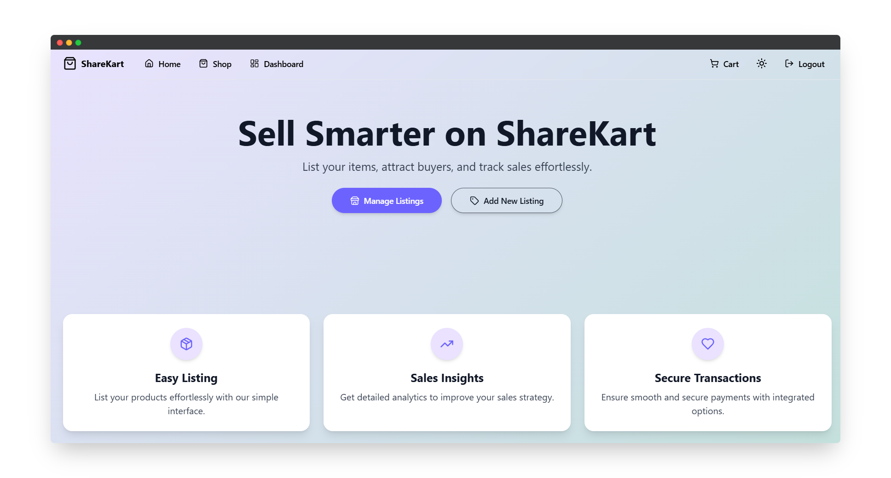

# **🛒 ShareKart – Buy, Sell & Donate with Ease**  

<p align="center">
  
</p>


## **🔹 Introduction**  
**ShareKart** is a platform to **buy, sell, and donate** pre-owned items at minimal or no cost. Whether it’s **stationery, books, clothes, or essentials**, ShareKart connects those who have with those who need.  

Designed with a **modern UI and seamless experience**, ShareKart ensures that users can effortlessly list items, browse available products, and contribute to a **sustainable, community-driven marketplace**.  
💡 **Reduce waste, share more, and help others!**  

## **✨ Features**  
✅ **Product Listings** – Browse products with a clean and structured layout  
✅ **Shopping Cart** – Add, remove, and manage items effortlessly  
✅ **Modern UI** – Uses **ShadCN & Tailwind CSS** for a sleek design  
✅ **Fast & Lightweight** – Built with **Vite** for better performance  
✅ **Feature Flags** – Integrated **Flagsmith** for feature management  
✅ **Responsive Design** – Optimized for **both mobile & desktop**  


## **🛠 Tech Stack**  
- **React + Vite** – Frontend framework for fast performance  
- **Tailwind CSS + ShadCN** – For styling and sleek UI components  
- **React Context API** – Manages global state like cart items  
- **Flagsmith** – Enables feature flag management 


## **🚀 Getting Started**  

### **1️⃣ Clone the Repository**  
```sh
git clone https://github.com/your-username/sharekart.git
cd sharekart
```

### **2️⃣ Install Dependencies**
```sh
npm install

```

### **3️⃣ Start the Development Server**
```sh
npm run dev

```
The project will run at http://localhost:5173


##Demo

https://github.com/user-attachments/assets/771f4998-a09a-4dff-be79-bd4307220221


## **🛒 How It Works?**
1. **Sign up/Login** – Join as a buyer, seller, or donor
2. **Browse Listings** – Find second-hand items at low or no cost
3. **Sell or Donate** – List items you no longer need and contribute to the community
4. **Easy Checkout** – Manage your items via the shopping cart


